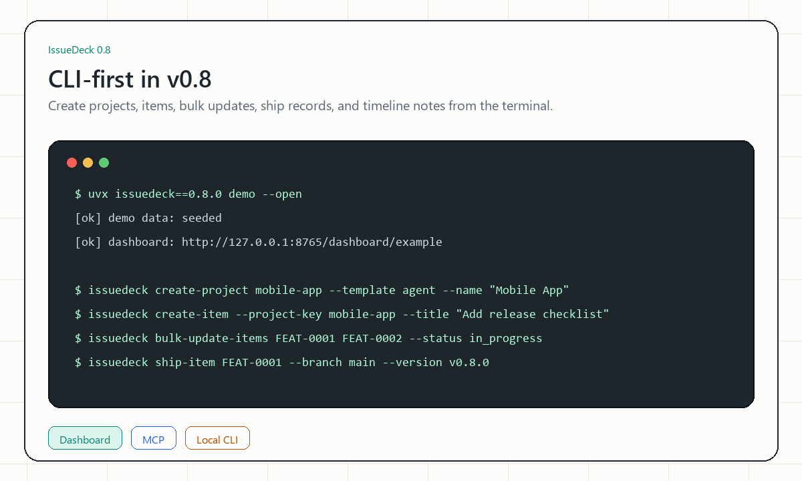

# IssueDeck

English | [简体中文](README.zh-CN.md)

[](https://github.com/xq520mmy/IssueDeck/actions/workflows/ci.yml)
[](https://github.com/xq520mmy/IssueDeck/releases)
[](LICENSE)

<p align="center">
  
</p>

**Lighter than Jira. More stable than Markdown.**

IssueDeck is a local-first, self-hosted issue deck for small teams and AI
coding workflows. It gives multiple projects one shared FastAPI + SQLite
tracker, a web dashboard for humans, and MCP tools for coding agents.

## Try It in 30 Seconds

Run the latest PyPI release with fake demo data:

```bash
uvx issuedeck demo --open
```

No clone or real project data is needed. The demo creates a local `example`
project and opens the dashboard. Sign in with `issuedeck-local-token`.

To try the latest unreleased `main` branch instead:

```bash
uvx --from git+https://github.com/xq520mmy/IssueDeck issuedeck demo --open
```

## Why IssueDeck

- Replace project-specific Markdown trackers with one structured source of
  truth that stays close to code, commits, branches, and releases.
- Give humans and coding agents the same workflow instead of maintaining a
  dashboard in one place and agent instructions in another.
- Start safely with demo data, then add real project configs when you are ready.



See the [screenshot gallery](docs/gallery.md) for list, kanban, detail,
search, and project creation surfaces.
Daily triage shortcuts are documented in
[Keyboard Shortcuts](docs/keyboard-shortcuts.md).
Agent handoffs and progress tracking are covered in
[Agent Work Sessions](docs/agent-work-sessions.md).
GitHub backlog imports are covered in
[GitHub Issues Import](docs/github-issues-import.md).
Dashboard CSV, JSON, and Markdown uploads are covered in
[Dashboard File Imports](docs/dashboard-file-imports.md).
Reopening earlier import batches is covered in
[Dashboard Import History](docs/dashboard-import-history.md).
Bulk cleanup after imports is covered in
[Dashboard Bulk Triage](docs/dashboard-bulk-triage.md).
Starter configs for new workspaces are covered in
[Project Templates](docs/project-templates.md).
Project-specific metadata is covered in [Custom Fields](docs/custom-fields.md).
Project snapshots are covered in
[Audit Bundles](docs/audit-bundles.md).

## Features

- Agent-ready: MCP tools let coding agents create, update, filter, relate, and
  ship tracked work, including custom fields, without scraping Markdown.
- Agent Work Sessions track which agent is working on which item, the goal,
  progress updates, and the final outcome.
- Multi-project: one SQLite DB holds items for any number of projects, keyed by
  `project_key`. Each project has its own `kinds`, `statuses`, `branches`,
  and numeric ID prefix (e.g. `FEAT-0001`, `BUG-0003`).
- Project-defined custom fields for extra item metadata such as priority,
  estimate, customer impact, and source URL, with list summaries,
  exact/range/presence dashboard and API filtering, bulk updates, and CSV/JSON
  import mappings.
- Starter project templates plus installable local template-pack examples for
  support queues, content calendars, and research workflows.
- Full-text search via SQLite FTS5.
- Bidirectional relationships (`blocks`/`blocked_by`, `related_to`).
- External links for GitHub issues, pull requests, commits, and other review context.
- GitHub URL helper to create linked IssueDeck items from issue, pull request,
  or commit URLs without a full sync engine.
- GitHub Issues importer for pulling repository issues into IssueDeck from the
  dashboard or CLI with state/label filters and duplicate skipping.
- CSV, JSON, and Markdown task-list import from the dashboard or CLI for turning
  tracker exports, `TODO.md`, and GitHub checklist items into IssueDeck work
  items.
- Item activity timeline with automatic lifecycle events and manual comments.
- Signed lifecycle webhooks for downstream automation on create, update, ship,
  delete, and restore events.
- Slack, Discord, and email lifecycle notifications for team-visible item updates.
- Built-in dashboard work queues for backlog, active, blocked, ready-to-ship,
  done, deleted, and recently touched items.
- Dashboard bulk triage for updating status, kind, tags, branches, delete, and
  restore across many selected items.
- Dashboard import history for reopening recent GitHub, CSV, JSON, and Markdown
  import batches.
- Project-scoped saved dashboard filters for reusable views such as active
  bugs, blocked work, release queues, and tag-specific searches.
- Soft delete + restore.
- Ship records with version + commits, queryable by shipped branch.
- Markdown export (one file per item) and changelog rendering.
- Project-level audit bundles for ZIP snapshots of config, items,
  relationships, work sessions, and import history.
- Frontmatter migration from existing Markdown trackers.
- Server-rendered dashboard with list, kanban, detail, search, and create/edit flows.
- Keyboard-friendly dashboard triage for search, filters, create, and item focus.
- Dashboard project creation with starter templates, language switching, and
  first-run setup checklist.
- MCP tools for coding-agent workflows.

## Requirements

- Python 3.11+
- [uv](https://docs.astral.sh/uv/)
- Docker, optional for container deployment
- Node.js 20+, only needed when changing dashboard styles

## Quickstart

Try the latest PyPI release without cloning:

```bash
uvx issuedeck demo --open
```

To try unreleased changes from GitHub:

```bash
uvx --from git+https://github.com/xq520mmy/IssueDeck issuedeck demo --open
```

Start a local dashboard with fake demo data:

```bash
uv run issuedeck demo
```

This creates a local `server.toml` if one does not exist, applies database
migrations, seeds the `example` project with fake items, and starts the server.
Then open `http://127.0.0.1:8765/dashboard/example` and sign in with
`issuedeck-local-token`.

To open the dashboard automatically:

```bash
uv run issuedeck demo --open
```

Health endpoints:

```bash
curl http://127.0.0.1:8765/healthz
curl http://127.0.0.1:8765/readyz
```

If the first run fails because of a missing `uv`, an occupied port, a token
problem, SQLite migrations, or Docker Compose startup, see the
[first-run troubleshooting guide](docs/troubleshooting.md).

Dashboard CSS is committed in the repository, so Node is not required to run
IssueDeck. If you change dashboard templates, helper class maps, or
`tailwind.config.cjs`, rebuild the CSS with `npm ci && npm run build:css`.

## Configure

`server.toml` controls the server:

```toml
host = "0.0.0.0"
port = 8765
api_token = "change-me-in-production"
data_dir = "./data"
projects_dir = "./projects"
```

For real use, set the token through the environment instead of committing it:

```bash
export ISSUEDECK_API_TOKEN="your-secret-token"
```

PowerShell:

```powershell
$env:ISSUEDECK_API_TOKEN = "your-secret-token"
```

`api_token` remains the backwards-compatible admin token. For multiple clients,
add scoped tokens:

```toml
[[tokens]]
name = "readonly"
token = "replace-with-readonly-token"
scopes = ["read"]

[[tokens]]
name = "agent"
token = "replace-with-agent-token"
scopes = ["agent"]

[[tokens]]
name = "admin-dashboard"
token = "replace-with-admin-token"
scopes = ["admin"]
```

`read` tokens can call read-only API endpoints. `agent` tokens can read and
write REST API resources for MCP/coding-agent workflows. `admin` tokens have
full API access and can sign in to the dashboard.

Project configs live in `projects/*.toml`. The dashboard can create new
projects from Basic issue deck, Agent workflow, and Software team starter
templates; edit TOML directly for advanced customizations. Local template packs
can be added through `project_templates_dir`; see
[Project Templates](docs/project-templates.md).

The same starter templates and installable example packs are available from the
CLI:

```bash
uv run issuedeck list-project-templates --config server.toml
uv run issuedeck list-project-template-examples
uv run issuedeck install-project-template-example support --config server.toml
uv run issuedeck create-project myapp \
  --config server.toml \
  --name "My App" \
  --template agent
```

Optional signed lifecycle webhooks can notify downstream automation when items
are created, updated, shipped, deleted, or restored; see
[Lifecycle Webhooks](docs/webhooks.md). The same guide covers Slack, Discord,
and email team notifications. Receiver examples for FastAPI, Flask, and
Node/Express live in
[Webhook Receiver Examples](docs/webhook-receivers.md).

Project files live in `projects/*.toml`. Each file defines one project and
must use the same file stem, `key`, and dashboard URL segment. The repository
includes `projects/example.toml` so the quickstart works immediately:

```toml
key = "myproject"
name = "My Project"
```

Dashboard: `http://127.0.0.1:8765/dashboard/myproject`

## Demo Data

Use fake data for screenshots, docs, or a clean local demo:

```bash
uv run issuedeck seed-demo --config server.toml --project-key example
```

If the target project already has items, the command refuses to overwrite it.
To intentionally replace that project's items, add `--force-reset`.

For the full first-run flow, prefer `uv run issuedeck demo`; it creates config,
runs migrations, seeds fake data, and starts the dashboard.

## CLI Item Workflow

Create a local item without starting the dashboard:

```bash
uv run issuedeck create-item \
  --config server.toml \
  --project-key example \
  --kind feature \
  --title "Add release checklist" \
  --tag ops \
  --custom-field priority=high \
  --external-link "Spec | https://example.com/spec"
```

Use `--body` for short notes, `--body-file notes.md` for longer Markdown, and
`--dry-run` to preview the payload before writing.

Update an existing item from the same terminal flow:

```bash
uv run issuedeck update-item FEAT-0001 \
  --config server.toml \
  --project-key example \
  --status in_progress \
  --append-body-file notes.md \
  --custom-field estimate=5
```

`update-item` can replace title, status, body, tags, branches, custom fields,
and external links. Use `--clear-external-links` when a link set should be
removed.

For post-import cleanup, update many items at once:

```bash
uv run issuedeck bulk-update-items FEAT-0001 FEAT-0002 \
  --config server.toml \
  --project-key example \
  --status in_progress \
  --tag triaged \
  --tag-mode replace
```

Set `--action delete` or `--action restore` for bulk cleanup. Bulk updates also
support branch and custom-field changes.

Record a shipped version and commit list:

```bash
uv run issuedeck ship-item FEAT-0001 \
  --config server.toml \
  --project-key example \
  --branch main \
  --version v1.0.0 \
  --commit abc1234
```

Append a comment, verification note, or handoff event:

```bash
uv run issuedeck append-item-event FEAT-0001 \
  --config server.toml \
  --project-key example \
  --event-type verification \
  --actor-type agent \
  --actor-name codex \
  --body "Checked locally before release."
```

List local items without starting the dashboard:

```bash
uv run issuedeck list-items \
  --config server.toml \
  --project-key example \
  --status in_progress \
  --custom-field 'estimate>=3'
```

Use `--format json` for scripts. Filters include `--kind`, `--status`, `--tag`,
`--applies-to`, `--relation-type`, `--custom-field`, `--include-deleted`, and
`--only-deleted`.

Show one item with full detail:

```bash
uv run issuedeck get-item FEAT-0001 --config server.toml --project-key example
```

## GitHub URL Helper

Create an IssueDeck item from a GitHub issue, pull request, or commit URL:

```bash
uv run issuedeck import-github-url \
  --config server.toml \
  --project-key example \
  --kind feature \
  https://github.com/example/repo/issues/42
```

Use `--dry-run` to preview the create payload before writing. See
[GitHub URL Import](docs/github-import.md).

## GitHub Issues Import

Import open issues from a repository and safely rerun later without duplicating
items that already have the same GitHub external link:

```bash
uv run issuedeck import-github-issues example/repo \
  --config server.toml \
  --project-key example \
  --kind feature \
  --state all \
  --status-map closed=done
```

Use `GITHUB_TOKEN` or `--github-token` for private repositories or higher rate
limits. From the dashboard, open a project and choose **Import GitHub** in the
sidebar to preview the same import before writing. See
[GitHub Issues Import](docs/github-issues-import.md).

## Markdown Task List Import

Import ordinary Markdown checklists from a file or directory:

```bash
uv run issuedeck import-markdown-list TODO.md \
  --config server.toml \
  --project-key example \
  --kind feature \
  --tag planning
```

Checked tasks are skipped by default; add `--include-checked` to import them
into the first terminal project status. See
[Markdown Task List Import](docs/markdown-task-list-import.md).

## CSV Import

Import tracker exports and spreadsheet rows:

```bash
uv run issuedeck import-csv issues.csv \
  --config server.toml \
  --project-key example \
  --preset github \
  --status-map open=proposed \
  --status-map closed=done
```

Use `--field-alias` for custom headers and `--dry-run` to validate before
writing. See [CSV Import](docs/csv-import.md).

## JSON Import

Import JSON arrays or wrapped tracker exports such as `{ "issues": [...] }`:

```bash
uv run issuedeck import-json issues.json \
  --config server.toml \
  --project-key example \
  --preset github \
  --status-map open=proposed \
  --status-map closed=done
```

Use `--field-alias` for custom keys and `--dry-run` to validate before writing.
See [JSON Import](docs/json-import.md).

## Hosted Tracker Exports

For GitHub Issues, Linear, Jira, and generic table exports, see
[Hosted Tracker Export Helpers](docs/hosted-tracker-exports.md). The guide
shows source export commands and matching `import-json` / `import-csv` calls.

## Run the server

```bash
# Start the server; it applies database migrations before listening.
export ISSUEDECK_API_TOKEN="your-secret-token"
uv run issuedeck serve --config server.toml
```

PowerShell:

```powershell
$env:ISSUEDECK_API_TOKEN = "your-secret-token"
uv run issuedeck serve --config server.toml
```

The dashboard uses the same shared token as the API. Open the dashboard URL,
enter `ISSUEDECK_API_TOKEN`, and IssueDeck will create an HTTP-only browser
session cookie. API and MCP clients should keep using the `Authorization:
Bearer <token>` header.

## Docker

The default Compose file pulls the published image from GitHub Container
Registry:

```bash
cp server.toml.example server.toml
cp .env.example .env
docker compose pull
docker compose up -d
```

Open `http://127.0.0.1:8765/dashboard/example` and sign in with
`ISSUEDECK_API_TOKEN` from `.env`.

To run a locally built image from source instead:

```bash
docker build -t issuedeck:local .
ISSUEDECK_IMAGE=issuedeck:local docker compose up -d
```

For offline or server deployment details, see [DEPLOY.md](DEPLOY.md). A longer
Chinese deployment guide is available at
[docs/deployment.zh.md](docs/deployment.zh.md). For a small production
hardening checklist, see
[Docker Compose Hardening](docs/docker-compose-hardening.md).

## MCP stdio process

For client-specific examples, see [MCP Client Setup](docs/mcp-clients.md).

Generic stdio config:

```json
{
  "mcpServers": {
    "issuedeck": {
      "command": "uv",
      "args": ["run", "python", "-m", "issuedeck.mcp"],
      "env": {
        "ISSUEDECK_BASE_URL": "http://127.0.0.1:8765",
        "ISSUEDECK_TOKEN": "your-secret-token"
      }
    }
  }
}
```

> **Note:** The MCP client reads `ISSUEDECK_TOKEN`; the server reads
> `ISSUEDECK_API_TOKEN`. They may hold the same value but the env var names
> differ by design (client/server are separate processes).

18 tools: `list_projects`, `get_project_config`, `create_item`, `update_item`,
`bulk_update_items`, `ship_item`, `append_item_event`, `delete_item`,
`get_item`, `list_items`, `search_items`, `add_relationship`, `remove_relationship`,
`start_work_session`, `list_work_sessions`, `get_work_session`,
`update_work_session`, `finish_work_session`. `create_item` and `update_item`
accept `custom_fields`; `bulk_update_items` can update custom fields across
many items; `list_items` accepts repeated `custom_field` filters.

The MCP process reads `ISSUEDECK_BASE_URL` and `ISSUEDECK_TOKEN`, then talks to
the REST server over HTTP. It does not access SQLite directly.

## Migrate from Markdown Frontmatter

```bash
uv run issuedeck migrate \
  --config server.toml \
  --from-frontmatter /path/to/markdown-tracker \
  --project-key myproject
```

Add `--dry-run` to preview without writing. Add `--force-reset` to wipe existing items first.
The importer accepts the canonical schema plus common aliases such as `type`,
`state`, and `labels`; see
[Markdown Frontmatter Import](docs/markdown-frontmatter-import.md) for the full
schema and custom alias options.

## Export

```bash
uv run issuedeck export \
  --config server.toml \
  --project-key myproject \
  --out ./export
```

Writes one `.md` file per item with YAML frontmatter.

## Development

```bash
uv sync
uv run pytest
uv run ruff check .
```

For dashboard UI work:

```bash
npm ci
npm run build:css
```

Read [CONTRIBUTING.md](CONTRIBUTING.md) before opening a pull request.
Maintainer and AI coding-window handoff rules are documented in
[Maintainer Workflow](docs/maintainer-workflow.md).
Dashboard UI work should follow [DESIGN.md](DESIGN.md).
Use the
[Dashboard Accessibility Smoke Checklist](docs/accessibility-checklist.md) for
UI changes.
See [ROADMAP.md](ROADMAP.md) for planned work and contribution areas.
Starter contribution candidates live in
[Starter Issue Backlog](docs/launch-issues.md).
Maintainer launch copy is collected in [Launch Kit](docs/launch-kit.md).
For support and issue-reporting guidance, see [SUPPORT.md](SUPPORT.md).
For sensitive vulnerabilities, follow [SECURITY.md](SECURITY.md).
For PyPI Trusted Publishing setup, see
[docs/pypi-publishing.md](docs/pypi-publishing.md).

## License

MIT. See [LICENSE](LICENSE).
Vendored dashboard browser assets are listed in
[THIRD_PARTY_NOTICES.md](THIRD_PARTY_NOTICES.md).
