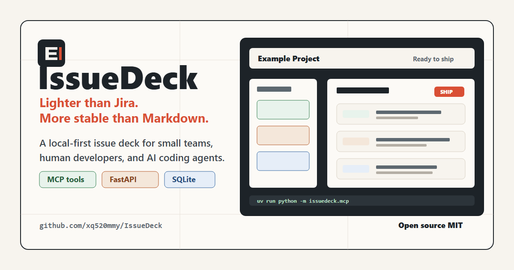
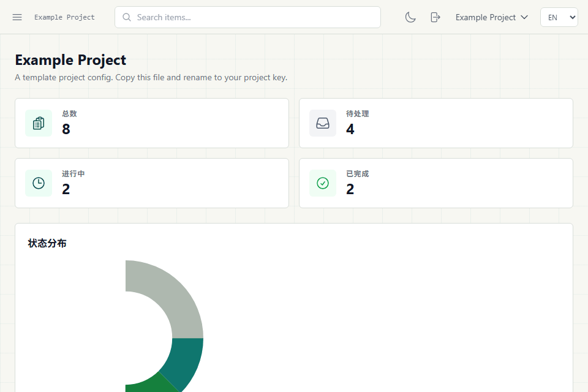

# IssueDeck

[English](README.md) | 简体中文

[](https://github.com/xq520mmy/IssueDeck/actions/workflows/ci.yml)
[](https://github.com/xq520mmy/IssueDeck/releases)
[](LICENSE)

<p align="center">
  
</p>

**比 Jira 更轻，比 Markdown 更稳。**

IssueDeck 是一个轻量、自托管的开发事项追踪器，面向小团队和 AI coding
工作流。它用一个 FastAPI + SQLite 服务管理多个项目，提供 Web Dashboard
给人使用，也提供 MCP tools 给 coding agent 使用。

## 为什么用 IssueDeck

- 用结构化服务替代散落在项目里的 Markdown tracker，事项、commit、分支和
  release 记录都在同一个地方。
- Dashboard 给人看，MCP tools 给 coding agent 调用，避免维护两套互相脱节的流程。
- 公开演示可以直接使用假数据，等准备好后再接入真实项目配置。



## 功能

- 面向 Agent：MCP tools 让 coding agent 可以直接创建、更新、搜索、关联和发布事项。
- 多项目：每个项目独立配置事项类型、状态、分支和 ID 前缀。
- SQLite FTS5 全文搜索。
- 双向关系：`blocks` / `blocked_by` / `related_to`。
- Activity Timeline：自动记录生命周期事件，也支持手动评论。
- Dashboard 工作队列：最近更新、待办、进行中、被阻塞、待发布、已完成、已删除。
- 已保存筛选：每个项目可以保存常用视图，比如活跃 Bug、阻塞事项、待发布队列或标签队列。
- 软删除和恢复。
- Ship 记录：绑定版本和 commit。
- Markdown 导出和通用 frontmatter 迁移。
- Dashboard 新建项目入口和语言切换基础。
- MCP tools，方便 coding agent 直接操作事项。

## 快速开始

```bash
uv run issuedeck demo
```

这个命令会在缺少 `server.toml` 时自动生成本地 demo 配置，执行数据库迁移，
写入 `example` 项目的假数据，并启动 Dashboard。

打开 `http://127.0.0.1:8765/dashboard/example`，使用 `issuedeck-local-token`
登录。想自动打开浏览器可以运行：

```bash
uv run issuedeck demo --open
```

## 假数据

公开截图、README 动图、本地演示都应该使用假数据：

```bash
uv run issuedeck seed-demo --config server.toml --project-key example
```

如果目标项目已经有事项，命令会拒绝覆盖。确认要替换该项目事项时再加
`--force-reset`。

第一次体验建议直接使用 `uv run issuedeck demo`，它会自动完成配置、迁移、
假数据和启动服务。

## 配置项目

`api_token` 会继续作为兼容旧部署的 admin token。需要给多个客户端分配权限时，
可以在 `server.toml` 里增加 scoped tokens：

```toml
[[tokens]]
name = "readonly"
token = "replace-with-readonly-token"
scopes = ["read"]

[[tokens]]
name = "agent"
token = "replace-with-agent-token"
scopes = ["agent"]

[[tokens]]
name = "admin-dashboard"
token = "replace-with-admin-token"
scopes = ["admin"]
```

`read` token 只能调用只读 API；`agent` token 可以读写 REST API，适合 MCP /
coding agent；`admin` token 拥有完整 API 权限，也可以登录 Dashboard。

项目配置位于 `projects/*.toml`。Dashboard 也提供了轻量的新建项目入口，
会生成默认的 Feature / Bug / Improvement 类型和 Proposed / In Progress /
Done / Won't Fix 状态。高级配置仍建议直接编辑 TOML。

## MCP

客户端配置示例见 [MCP 客户端接入](docs/mcp-clients.zh-CN.md)。

MCP 进程通过 REST API 与 IssueDeck 通信，不直接访问 SQLite。环境变量：

```bash
ISSUEDECK_BASE_URL=http://127.0.0.1:8765
ISSUEDECK_TOKEN=your-secret-token
```

## Markdown 迁移

导入器支持标准 frontmatter 字段，也默认识别 `type`、`state`、`labels`
等常见别名。完整 schema 和自定义别名示例见
[Markdown Frontmatter 导入](docs/markdown-frontmatter-import.zh-CN.md)。

## 开源发布提醒

`data/*` 和除 `projects/example.toml` 之外的项目配置已经被 `.gitignore`
忽略。发布前请确认本地真实项目数据没有被加入 git。

## License

MIT. See [LICENSE](LICENSE).

路线图见 [ROADMAP.md](ROADMAP.md)。
